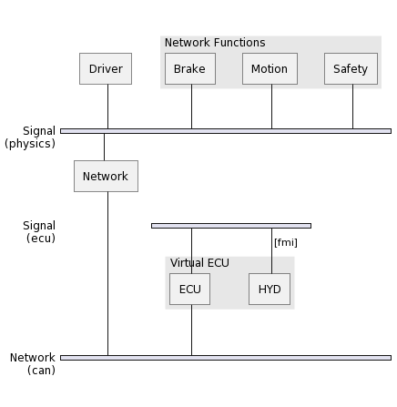

<!--
Copyright 2024 Robert Bosch GmbH

SPDX-License-Identifier: Apache-2.0
-->

# Dynamic Simulation Environment - Network Model

[](https://github.com/boschglobal/dse.network/actions/workflows/ci.yaml)
[](https://github.com/boschglobal/dse.network/actions/workflows/super-linter.yml)


## Introduction

Network Model of the Dynamic Simulation Environment (DSE) Core Platform.

The Network Model can be used in simulations to connect Models to a (virtual) Network in cases where
the Models themselves do not include a Communication Stack (which would connect to that Network).
The resultant Functional Simulation (FSIL) may be used to validate complex functional interactions that span the entire network/ecu topology.

The following diagram shows how Network Functions and a Virtual ECU may be connected using the Network Model to form a typical FSIL simulation.

<div hidden>

```
@startuml
nwdiag {
  Driver
  Brake
  Motion
  Safety

  network Signal {
    address = (physics)
    Network

    Driver
    group function {
      description = "Network Functions"
      Brake
      Motion
      Safety
    }
  }
  network Signal {
    address = (ecu)
    group ecu {
      description = "Virtual ECU"
      ECU
      HYD [address = "        fmi"]
    }
  }
  network Network {
    address = (can)
    width = full

    Network
    ECU
  }
}
@enduml
```

</div>




The Network Model is implemented with the [Model C Library](https://github.com/boschglobal/dse.modelc) and uses the
[Network Codec](https://github.com/boschglobal/dse.standards/tree/main/dse/ncodec) for interfacing with (virtual) Networks/Buses.
The [Network Codec](https://github.com/boschglobal/dse.standards/tree/main/dse/ncodec) provides an implementation of the [Automotive Bus Schema](https://github.com/boschglobal/automotive-bus-schema).


### Project Structure

```
L- dse/network  Network Model source code.
L- extra        Build infrastructure.
  L- tools      Containerised tools.
L- licenses     Third Party Licenses.
L- tests        Unit and integration tests.
```


## Usage

Network models can be built using the `network` tool (part of this project).
A simulation comprised of both network models and other models can be run using the `simer` tool (part of the Model C project).

```bash
# Install Task and clone the network repo (includes Taskfile automation).
$ sudo snap install task --classic
$ git clone https://github.com/boschglobal/dse.network.git
$ cd dse.network

# Download the tutorial (or build locally with `make` command) ...
$ export NETWORK_URL=https://github.com/boschglobal/dse.network/releases/download/v1.0.1/Network-1.0.2-linux-amd64.zip
$ curl -fSL -o /tmp/network.zip $NETWORK_URL; unzip -d ./tutorial /tmp/network.zip

# Change to the simulation root directory (i.e. the tutorial directory).
$ cd tutorial/Network-1.0.2-linux-amd64/examples/brake-by-wire

# Generate network code and configuration files.
$ task generate \
    DBCFILE=networks/brake/brake.dbc \
    SIGNAL=can \
    MIMETYPE="application/x-automotive-bus; interface=stream; type=frame; bus=can; schema=fbs; bus_id=1; node_id=1; interface_id=1"
$ task generate \
    DBCFILE=networks/vehicle/vehicle.dbc \
    SIGNAL=can \
    MIMETYPE="application/x-automotive-bus; interface=stream; type=frame; bus=can; schema=fbs; bus_id=1; node_id=2; interface_id=1"


# Define a shell function for the Simer tool.
$ export SIMER_IMAGE=ghcr.io/boschglobal/dse-simer:2.0.11
$ simer() { ( cd "$1" && shift && docker run -it --rm -v $(pwd):/sim $SIMER_IMAGE "$@"; ) }

# Run the simulation.
$ simer . -endtime 0.04
```

Documentation for the `simer` tool is available here : https://boschglobal.github.io/dse.doc/docs/user/simer


## Build

> Note : see the following section on configuring toolchains.

```bash
# Get the repo.
$ git clone https://github.com/boschglobal/dse.network.git
$ cd dse.network

# Optionally set builder images.
$ export GCC_BUILDER_IMAGE=ghcr.io/boschglobal/dse-gcc-builder:main

# Build.
$ make

# Run tests.
$ make test

# Build containerised tools.
$ make tools

# Remove (clean) temporary build artifacts.
$ make clean
$ make cleanall
```


### Toolchains

The Network Model is built using containerised toolchains. Those are
available from the DSE C Library and can be built as follows:

```bash
$ git clone https://github.com/boschglobal/dse.clib.git
$ cd dse.clib
$ make docker
```

Alternatively, the latest Docker Images are available on ghcr.io and can be
used as follows:

```bash
$ export GCC_BUILDER_IMAGE=ghcr.io/boschglobal/dse-gcc-builder:main
```


## Contribute

Please refer to the [CONTRIBUTING.md](./CONTRIBUTING.md) file.


## License

Dynamic Simulation Environment Network Model is open-sourced under the Apache-2.0 license.
See the [LICENSE](LICENSE) and [NOTICE](./NOTICE) files for details.


### Third Party Licenses

[Third Party Licenses](licenses/)
